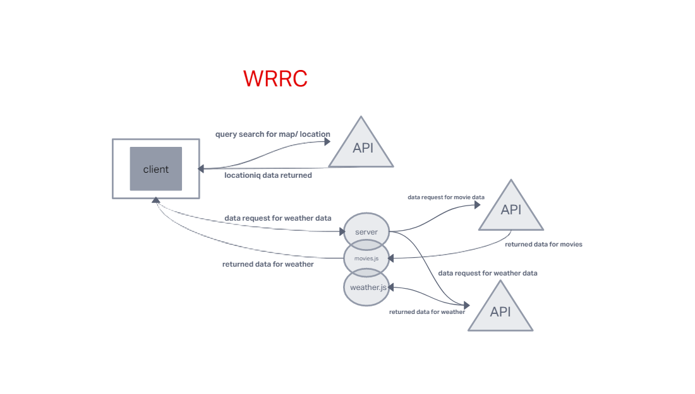

# City Explorer

**Author**: Cody De La Torre
**Version**: 1.0.0 (increment the patch/fix version number if you make more commits past your first submission)

## Overview

Building this project at Code Fellows to leanr understand the process of using APIs

## Getting Started
<!-- What are the steps that a user must take in order to build this app on their own machine and get it running? -->

## Architecture
<!-- Provide a detailed description of the application design. What technologies (languages, libraries, etc) you're using, and any other relevant design information. -->

## Change Log
<!-- Use this area to document the iterative changes made to your application as each feature is successfully implemented. Use time stamps. Here's an example:

01-01-2001 4:59pm - Application now has a fully-functional express server, with a GET route for the location resource. -->

## Credit and Collaborations

[background image](https://unsplash.com/photos/AFB6S2kibuk)

Name of feature: Lab6

Estimate of time needed to complete: 2 hours

Start time: 5:00pm

Finish time: 9:00pm

Actual time needed to complete: 4 hours

